[](https://www.python.org)
[](https://github.com/I-am-shadowspawn/HA_Microclimate_Integration)
[](https://github.com/I-am-shadowspawn/HA_Microclimate_Integration/releases)
[](https://github.com/I-am-shadowspawn/HA_Microclimate_Integration/blob/main/LICENSE)

# Microclimate Integration for Home Assistant

A custom Home Assistant integration for **Microclimate Evo Connect** environmental controllers.

The integration brings controller and channel data into Home Assistant and provides controls and dashboard cards for viewing and editing supported controller settings and schedules.

<p align="center">
&#x20; 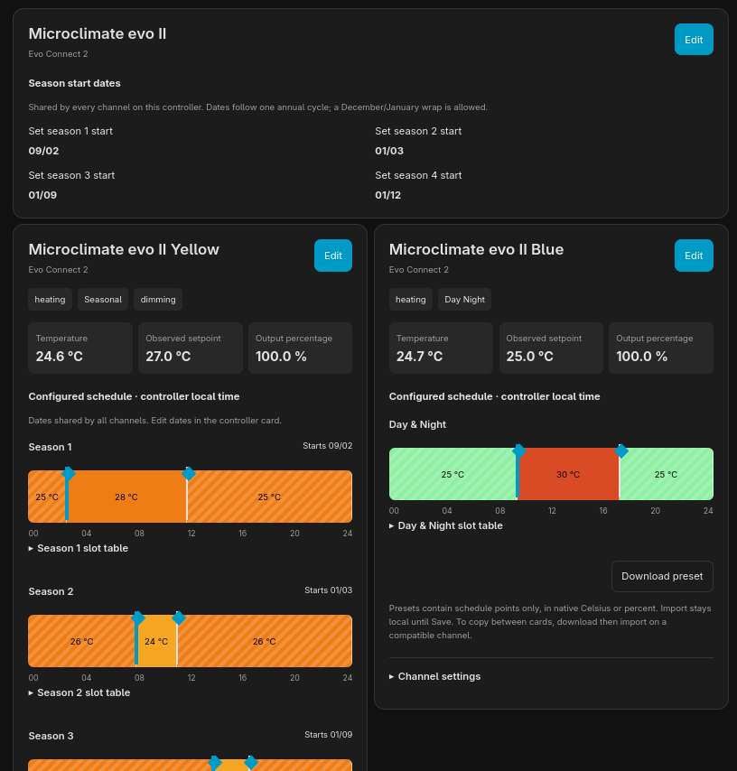
</p>

> **Unofficial, independent project.**  
> This integration and its custom cards are not affiliated with, endorsed by, or supported by **Microclimate or Blynk**. Their names and product/service names are used solely to identify compatibility and the external services on which the integration depends. For support with this integration, use this project's [GitHub Issues](https://github.com/I-am-shadowspawn/HA_Microclimate_Integration/issues).
---

## Features

The integration provides Home Assistant access to supported Microclimate controller data and configuration, including:

- automatic creation of controller and channel devices;
- temperature and probe readings where supported;
- observed controller setpoints;
- output levels and control modes;
- alarm thresholds;
- timing and schedule configuration;
- Day/Night, Multi and Seasonal schedule display;
- editable schedules for supported operating modes;
- root controller season-date configuration;
- ramp-duration controls on supported channels;
- readback-confirmed configuration changes;
- schedule preset import, export and copy functions;
- Home Assistant actions for schedule operations;
- custom Lovelace cards for controller and channel configuration;
- optional diagnostic entities and support diagnostics;
- Home Assistant user permission enforcement for configuration changes.

Normal sensor and climate observations remain read-only. Configuration changes are made through dedicated controls and the supplied dashboard cards.

---

## Supported controllers

| Controller          | Status                           | Channels          |
|---------------------|----------------------------------|-------------------|
| **Evo Connect**     | Supported                        | Yellow, Blue      |
| **Evo Connect II**  | Supported                        | Yellow, Blue      |
| **Evo Connect III** | Supported                        | Yellow, Red, Blue |
| **Evo Connect Pro** | Untested / compatibility unknown | Unknown           |

The **Evo Connect Pro has not been tested** with this integration. Compatibility should not be assumed until controller/API evidence is available.

Support may also vary with controller firmware and channel type. See [Supported functionality](#supported-functionality) and the [schedule contract](docs/technical/SCHEDULE-CONTRACT.md) for known behaviour and limitations.

---

## Requirements

- Home Assistant Core **2026.9.3 or later**
- a supported Microclimate Evo Connect controller;
- access to the Microclimate web dashboard;
- the controller's **Auth Token**;
- internet access from Home Assistant to the Microclimate cloud service.

This integration communicates with the controller through the remote Microclimate/Blynk service. There is currently **no local-controller fallback** if the cloud service or internet connection is unavailable.

See [TESTED-PLATFORM.md](docs/User/TESTED-PLATFORM.md) for the Home Assistant, frontend and platform versions used for release testing.

---
## Service dependency and third-party services

This integration communicates with Microclimate controllers through the cloud service used by the official Microclimate platform, which is provided using **Blynk** infrastructure. It does not communicate directly with the controller over the local network.

Use of the Microclimate/Blynk service remains subject to the applicable terms and service arrangements provided by Microclimate and Blynk. This project is not a party to, and makes no representation about, the commercial or licensing arrangements between those companies.

This project is independent and is not affiliated with, endorsed by, or supported by either **Microclimate** or **Blynk**. References to their names and services are solely to describe compatibility and the external services on which the integration depends.

Availability of this integration therefore depends on the continued availability and compatibility of the relevant Microclimate/Blynk cloud service. Changes to that service, its API, authentication requirements or applicable terms may affect or prevent the integration from operating.

---

# Installation

## 1. Obtain your Microclimate Auth Token

Before adding the integration to Home Assistant, obtain the **Auth Token** associated with your controller from the Microclimate web dashboard:

**[http://microclimate.blynk.cc/](http://microclimate.blynk.cc/)**

Sign in to the Microclimate dashboard and obtain the Auth Token for the controller you want to add.

> **Keep the Auth Token private.**\
> Treat it as a credential. Do not include it in screenshots, GitHub issues, logs or other publicly shared material.

You will need this token when configuring the integration in Home Assistant.

---

## 2. Install the integration

### HACS

When installing through HACS, install **Microclimate Integration** as an integration and restart Home Assistant when prompted.

If the repository is not yet available in the default HACS catalogue, it can be added as a custom repository once the corresponding HACS release has been published and validated.

### Manual installation

For a manual installation:

1. Download the repository or release archive.

2. Copy:

   ```text
   custom_components/microclimate_integration
   ```

   into:

   ```text
   <home-assistant-config>/custom_components/microclimate_integration
   ```

3. Restart Home Assistant.

The resulting directory should be:

```text
config/
└── custom_components/
    └── microclimate_integration/
        ├── __init__.py
        ├── manifest.json
        └── ...
```

---

# Add your controller to Home Assistant

After installing and restarting Home Assistant:

1. Open **Settings → Devices & services**.
2. Select **Add Integration**.
3. Search for **Microclimate Integration (Unofficial)**.
4. Enter the requested controller details, including:
   - a name for the controller;
   - the Microclimate **Auth Token**;
   - the controller model.
5. Complete the setup.

<p align="center">
&#x20; 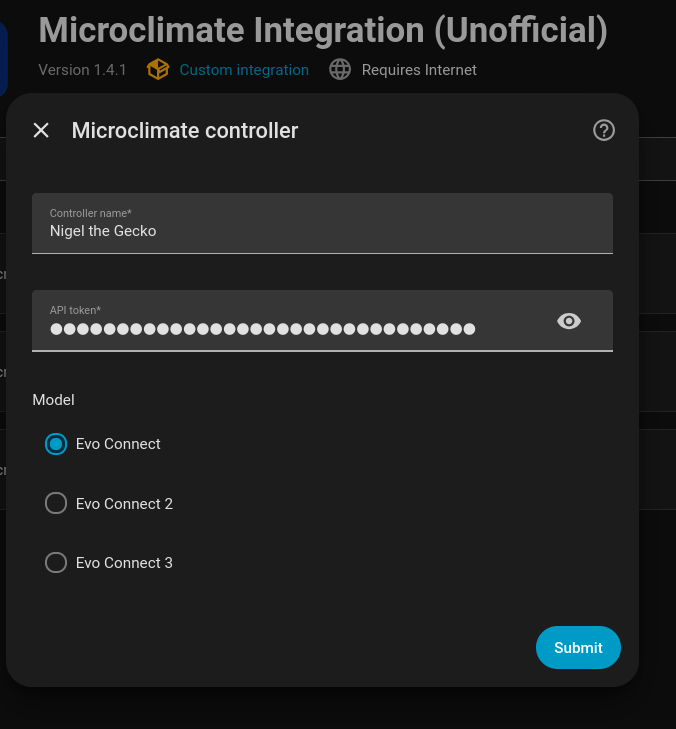
</p>

Home Assistant will create the root controller device and the appropriate channel devices for the selected controller model.

You can assign the newly created devices to Home Assistant Areas during onboarding.

<p align="center">
&#x20; 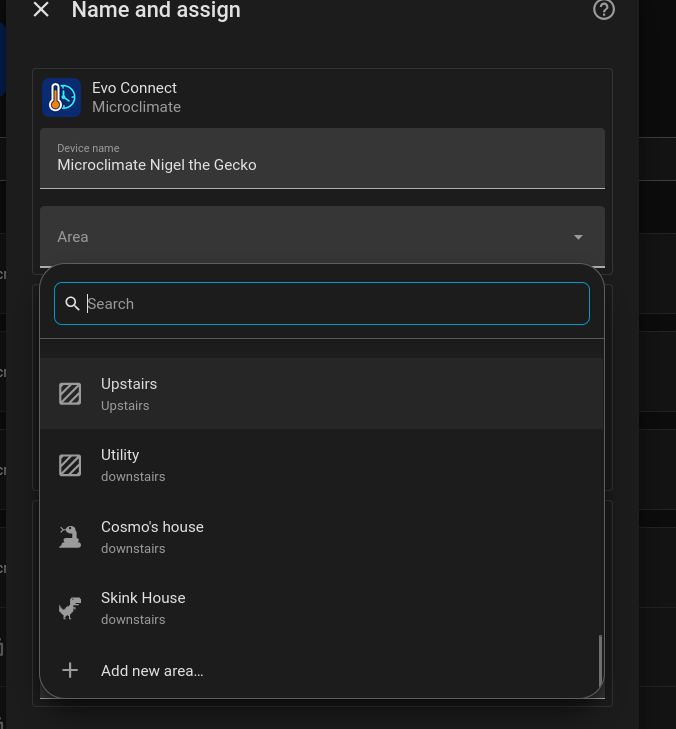
</p>

Once configuration is complete, the integration page shows the controller and its discovered channel devices.

<p align="center">
&#x20; 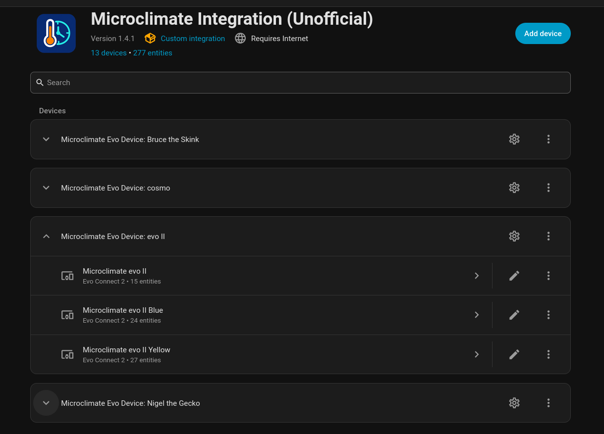
</p>

---

# Devices and entities

Each integration entry creates:

- one **root controller device**; and
- separate devices for each controller channel.

For example, an Evo Connect II creates a root controller plus Yellow and Blue channel devices.

## Controller device

The root controller contains controller-wide information and settings such as:

- controller metadata;
- system date/time information;
- season start dates;
- previous 24-hour power information where reported;
- configuration/status information.

<p align="center">
&#x20; 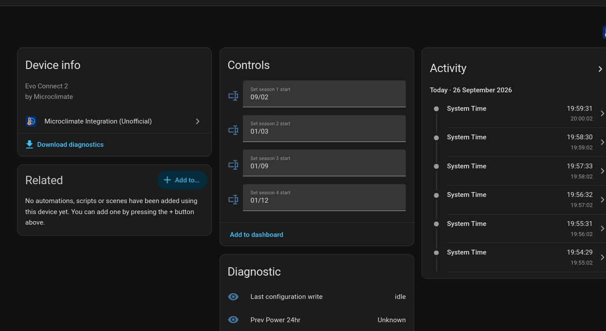
</p>

## Channel devices

Channel devices expose the readings and controls appropriate to that channel and controller model.

Depending on the channel, these can include:

- temperature;
- observed setpoint;
- lower and upper alarm thresholds;
- output percentage;
- operating mode;
- timing mode;
- ramp duration;
- reported schedule;
- configuration controls.

<p align="center">
&#x20; 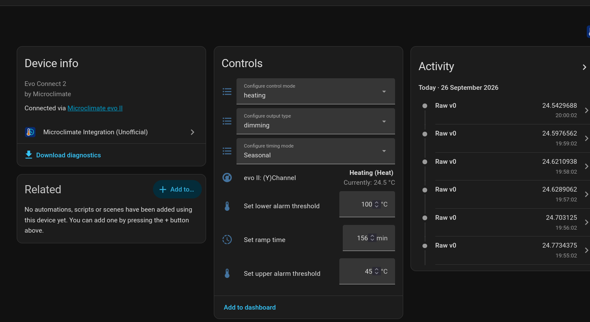
</p>

Unavailable or invalid controller readings are represented as unknown or unavailable rather than being guessed.

Temperature values supplied by the supported controller API are treated as Celsius internally. Home Assistant can convert these for display according to the Home Assistant unit configuration.

---

# Dashboard cards

The integration includes custom cards designed specifically for configuring the Microclimate controller.

There are two principal card types:

- **Channel Schedule Card** — displays and edits the schedule for a controller channel.
- **Controller Season Card** — displays and edits controller-wide season start dates.

The cards provide explicit **Edit**, **Save** and **Cancel** behaviour so that changing values in the editor does not immediately write them to the controller.

For full card configuration and usage instructions, see [CARD-USAGE.md](docs/User/CARD-USAGE.md).

---

## Channel Schedule Card

The Channel Schedule Card displays the current mode and schedule for a selected controller channel.

<p align="center">
&#x20; 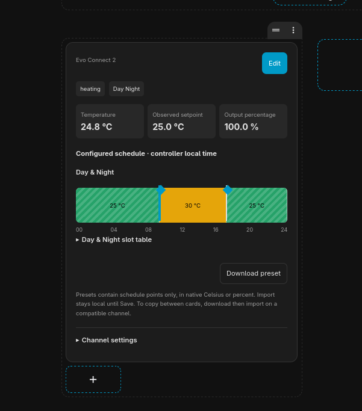
</p>

The card can be added through the Home Assistant dashboard card editor.

<p align="center">
&#x20; 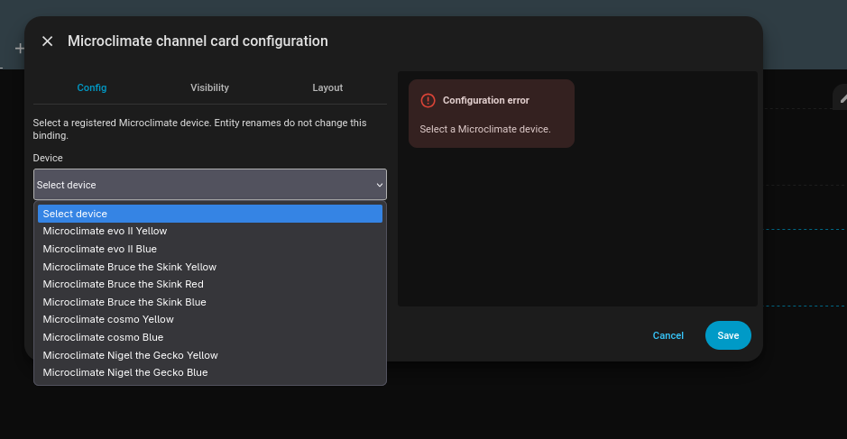
</p>

<p align="center">
&#x20; 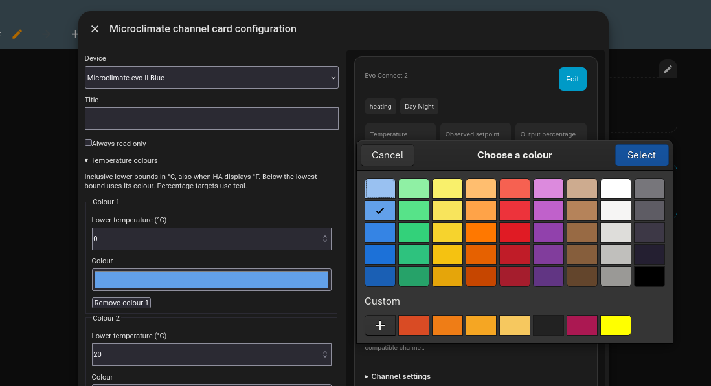
</p>

The card uses the channel's **Reported schedule periods** entity to identify the schedule and as the Home Assistant permission scope for schedule access.

Do not disable that entity if you intend to use the schedule card.

---

## Controller Season Card

The Controller Season Card provides a compact view of the controller's season start dates.

<p align="center">
&#x20; 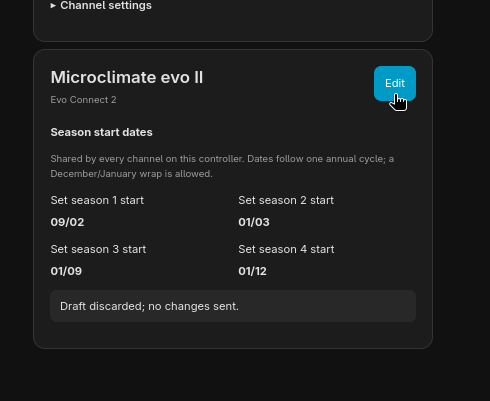
</p>

It can be configured through the normal Home Assistant card editor.

<p align="center">
&#x20; 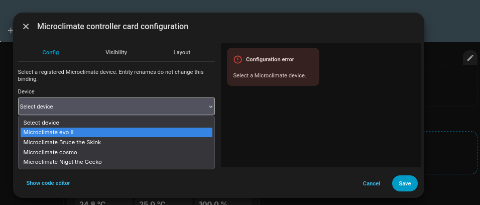
</p>

When editing is enabled, changes remain local to the card until explicitly saved.

<p align="center">
&#x20; 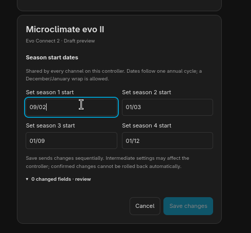
</p>

<p align="center">
&#x20; 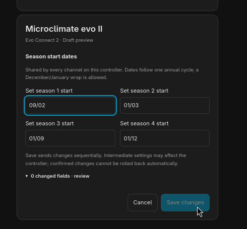
</p>

---

# Supported functionality

The controller families use different channel capabilities.

## Channel availability

| Controller      | Yellow | Red | Blue |
|-----------------|:------:|:---:|:----:|
| Evo Connect     |   ✓    |  —  |  ✓   |
| Evo Connect II  |   ✓    |  —  |  ✓   |
| Evo Connect III |   ✓    |  ✓  |  ✓   |
| Evo Connect Pro |   ?    |  ?  |  ?   |

`?` indicates that compatibility has not been established.

## Schedule modes

| Mode      | Yellow | Red |   Blue    |
|-----------|:------:|:---:|:---------:|
| Constant  |   ✓    |  ✓  |     ✓     |
| Day/Night |   ✓    |  ✓  |     ✓     |
| Multi     |   ✓    |  ✓  |     ✓     |
| Seasonal  |   ✓    |  ✓  |     ✓     |
| Periodic  |   —    |  —  | Blue only |

Availability of Red depends on the controller model.

Manual schedule editing is currently intended for schedule structures whose mapping has been established. Some Constant and Periodic controller fields remain deliberately read-only or uninterpreted where their meaning has not been verified.

The integration does **not guess unknown vendor fields**.

For the detailed evidence and schedule mapping, see [SCHEDULE-CONTRACT.md](docs/technical/SCHEDULE-CONTRACT.md).

---

# Schedule behaviour

Depending on the selected timing mode, the integration can present controller schedule data as:

### Day/Night

Two time/setpoint pairs representing the configured day and night periods.

### Multi

Up to eight daily time/setpoint points, retained in controller order.

### Seasonal

Four seasonal Day/Night pairs together with the controller's four season start dates.

### Constant

Constant mode is recognised, but editable Constant-target behaviour is not exposed unless the underlying controller field has been verified for that device family.

### Periodic

Periodic mode is reported for supported Blue channels. Unknown interval/duration semantics are preserved rather than assigned an unverified meaning.

The integration does not calculate or claim a device-confirmed "currently active schedule period" solely from the stored schedule.

---

# Editing controller settings

Configuration writes are supported for validated controller fields.

Writes use fresh controller state and readback confirmation rather than assuming that an HTTP request means a change was successfully applied.

This is particularly important for schedules because a schedule update may require multiple controller operations and should **not be considered atomic**.

Configuration writes can be disabled from the integration's options if a read-only installation is preferred.

For details on supported controls, validation and recovery behaviour, see:

- [Write controls](docs/User/WRITE-CONTROLS.md)
- [Validation contract](docs/technical/VALIDATION-CONTRACT.md)
- [Schedule presets](docs/User/SCHEDULE-PRESETS.md)

---

# Schedule presets

Supported channel schedules can be exported and imported using the supplied card functionality.

Home Assistant actions are also available for supported operations such as:

- exporting schedules;
- applying compatible schedules;
- copying compatible schedules between devices.

Presets are validated against the target channel/device before writes are performed.

See [SCHEDULE-PRESETS.md](docs/User/SCHEDULE-PRESETS.md) for the preset format, compatibility requirements and usage.

---

# Permissions

Home Assistant permissions are respected by the card API.

The **Reported schedule periods** entity acts as the permission anchor for a channel schedule:

- users require suitable read access to view schedule data;
- users require suitable control permission to modify it.

This entity is therefore enabled by default even though it represents diagnostic/configuration-oriented information.

Raw pin diagnostics are separate and are disabled by default.

---

# Polling and cloud access

The integration uses one Home Assistant update coordinator per configured controller entry.

The controller is normally refreshed approximately once per minute. Multiple entities use the same coordinator data rather than independently polling the cloud service.

Because access is cloud-based:

- internet or service outages can make entities unavailable;
- authentication failures may require token reauthentication;
- controller changes made elsewhere can appear on the following refresh;
- write operations are verified against subsequent controller state.

Automatic repeated write retries and speculative rollback are intentionally avoided.

---

# Diagnostics and troubleshooting

## Authentication problems

If authentication fails:

1. confirm that the controller still appears in the Microclimate web dashboard;
2. obtain or confirm the Auth Token at **[http://microclimate.blynk.cc/](http://microclimate.blynk.cc/)**;
3. use the Home Assistant integration's reauthentication/reconfiguration flow.

Never post your Auth Token in an issue.

## Card does not show a schedule

Check that:

- the correct channel device is selected;
- the **Reported schedule periods** entity is enabled;
- the Home Assistant user has permission to read it;
- the card and backend integration versions match.

## Schedule cannot be edited

Check that:

- configuration writes have not been disabled in the integration options;
- the Home Assistant user has control permission;
- the current timing mode supports editing;
- the controller data required to safely construct the change is available.

## Support diagnostics

When reporting a problem, Home Assistant diagnostics can provide useful structural and version information while redacting known credential fields.

Additional full API response logging can be enabled explicitly for investigation where necessary. Full response captures may contain controller names, readings or other private information and should always be reviewed before sharing.

For support, open a [GitHub Issue](https://github.com/I-am-shadowspawn/HA_Microclimate_Integration/issues).

---

# Upgrading

Normal integration upgrades are intended to retain the Home Assistant config entry, device identity and entity registry bindings.

Before upgrading:

1. review [CHANGELOG.md](CHANGELOG.md) for release-specific changes;
2. install the new release through HACS or replace the manual installation;
3. restart Home Assistant if required by the installation method;
4. confirm that the integration and custom cards load correctly.

If authentication credentials change, use the integration's reauthentication or reconfiguration flow rather than deleting and recreating the integration.

---

# Known limitations

- Communication is through the Microclimate cloud service; local controller communication is not currently available.
- **Evo Connect Pro is untested and its compatibility is unknown.**
- Some vendor fields remain intentionally uninterpreted where their purpose, unit or range has not been established.
- Constant-target editing is not exposed where the correct controller field has not been verified.
- Blue Periodic interval/duration editing is not exposed until its field semantics are verified.
- Schedule changes involving multiple values are not atomic.
- Controller persistence following physical reboot or extended service interruption depends on controller behaviour and should not be inferred solely from successful API readback.
- The integration does not infer active alarms merely from configured alarm thresholds.
- Stored schedule data is not presented as proof of the controller's currently active period.

Unknown behaviour is preserved or reported as unsupported rather than guessed.

---

## Documentation

### User guides

- [Card usage](docs/user/CARD-USAGE.md)
- [Schedule presets](docs/user/SCHEDULE-PRESETS.md)
- [Write controls](docs/user/WRITE-CONTROLS.md)
- [Tested platforms](docs/user/TESTED-PLATFORM.md)

### Technical documentation

- [Schedule contract](docs/technical/SCHEDULE-CONTRACT.md)
- [Validation contract](docs/technical/VALIDATION-CONTRACT.md)
- [Card API](docs/technical/CARD-API.md)
- [Runtime lifecycle](docs/technical/RUNTIME-LIFECYCLE.md)
- [Development and testing](docs/technical/TESTING.md)

### Project information

- [Contributing](CONTRIBUTING.md)
- [Support](SUPPORT.md)
- [Security](SECURITY.md)
- [Licensing](docs/project/LICENSING.md)
- [Branding](docs/project/BRANDING.md)
- [Changelog](CHANGELOG.md)
---

# Reporting issues

Please report integration problems through:

[GitHub Issues](https://github.com/I-am-shadowspawn/HA_Microclimate_Integration/issues)

When reporting an issue, include where possible:

- controller model;
- controller firmware version;
- Home Assistant Core version;
- integration version;
- affected channel;
- relevant timing/control mode;
- a description of the expected and observed behaviour.

Do **not** include your Microclimate Auth Token.

For security-sensitive reports, follow [SECURITY.md](SECURITY.md).

---

# Development

Contributions and testing are welcome.

See [CONTRIBUTING.md](CONTRIBUTING.md) for development and validation guidance.

The integration aims to preserve controller behaviour exactly where it has been verified and to leave unknown or unconfirmed vendor behaviour explicit rather than attempting to infer it.

---
# Licence

This project is licensed under the **MIT License**. See [LICENSE](LICENSE) and [LICENSING.md](docs/project/LICENSING.md).

Maintained by **`@I-am-shadowspawn`**.

Microclimate and Blynk product names, images, logos and trademarks belong to their respective owners. 

This project is independent and is not affiliated with or endorsed by Microclimate or their service provider Blynk.
