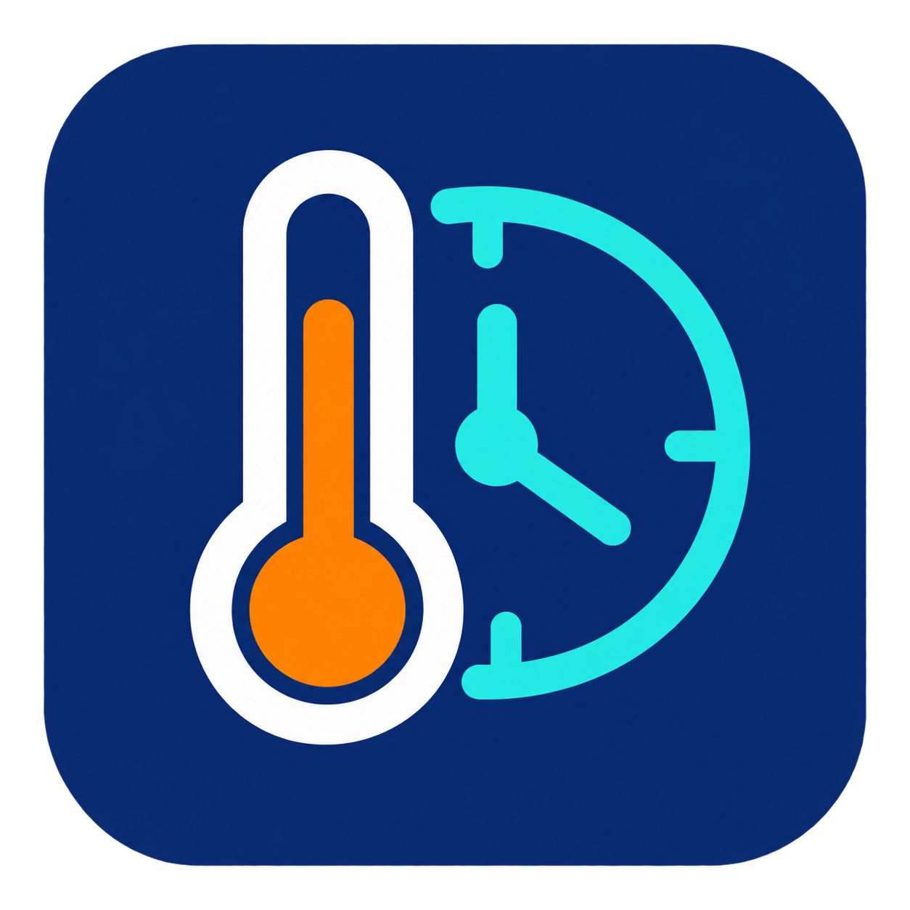

# Independent project branding

> **Unofficial, independent project.** This integration and its custom cards are not affiliated with, endorsed by, or supported by Microclimate. Their only connection to Microclimate is that they work with its products. Product names are used solely to identify compatibility. For integration support, use this project’s [GitHub Issues](https://github.com/I-am-shadowspawn/HA_Microclimate_Integration/issues).

The thermometer-and-clock icon was generated specifically for this independent project on 25 September 2026 using OpenAI image generation, without an input image. Its brief requested temperature and scheduling symbolism, no text, no gecko, and no Microclimate or Home Assistant logo. It is a draft for maintainer review, included in the local candidate at `custom_components/microclimate_integration/brand/icon.png`.

The generated draft is distributed under the project's MIT licence to the extent the project holds rights in it. This records provenance and intended reuse; it does not assert trademark registration or exclusivity. The integration and HACS names include “Unofficial”.

The previously supplied gecko image is excluded from this source tree and release packages; permission for that separate artwork was never confirmed. It remains only in an external private draft folder and is not a release dependency.

Home Assistant supports [local custom-integration brand images](https://developers.home-assistant.io/docs/core/integration/brand_images/); HACS requires a [brand icon](https://hacs.xyz/docs/publish/integration/). Review the draft appearance before public release.

